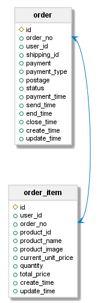
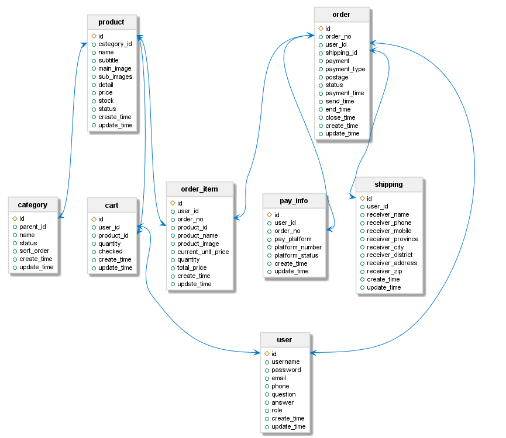

---
<div align="center">
<b><em>sql-analyzer</em></b><br>
通过对SQL语句进行静态分析，自动生成数据库表的关系图。
</div>

<div align="center">

[](http://opensource.org/licenses/MIT)

</div>

---

- [What is sql-analyzer?](#what-is-sql-analyzer-)
- [Supported Database](#supported-database)
- [Quick Start](#quick-start)

## What is sql-analyzer?

在数据库设计规范上，互联网公司通常要求禁止使用外键。原因这里不加讨论。无法使用外键带来一个问题，对于数据库来说每张表都是孤立的，我们无法依赖数据库管理工具自动导出表的关系图。这会给我们系统维护带来困扰，比如：

- 新成员进入团队，很难迅速理清各张表的关联关系。
- 需要修改某个字段，但不知该字段与哪些表关联，是否会影响到别的表。

手动维护数据库表关系图的成本极高，且难以保证正确性和及时性。

表的关联关系最终体现在 SQL 语句中的各种 JOIN 操作上。那么不如**直接对 SQL 语句进行静态分析，依据 JOIN 语句来自动生成表的关系图**。这就是 sql-analyzer 要完成的工作。

## Supported Database

目前只支持 MySQL 5.6/5.7 版本的 SQL 语句。

## Quick Start

1. 安装[graphviz-dot](https://www.graphviz.org/download/)。sql-analyzer 依赖于[PlantUML](https://plantuml.com/zh/index)生成图片，而 PlantUML 依赖于 graphviz-dot。下载并安装 graphviz-dot 后，请添加环境变量`GRAPHVIZ_DOT`，将其值设置为`<graphviz-dot安装目录>/bin/dot.exe`。

2. 假设我们目前有如下 SQL：

```sql
-- 建表语句1
CREATE TABLE `order`
(
    `id`           int(11) NOT NULL AUTO_INCREMENT COMMENT '订单id',
    `order_no`     bigint(20)     DEFAULT NULL COMMENT '订单号',
    `user_id`      int(11)        DEFAULT NULL COMMENT '用户id',
    `shipping_id`  int(11)        DEFAULT NULL,
    `payment`      decimal(20, 2) DEFAULT NULL COMMENT '实际付款金额,单位是元,保留两位小数',
    `payment_type` int(4)         DEFAULT NULL COMMENT '支付类型,1-在线支付',
    `postage`      int(10)        DEFAULT NULL COMMENT '运费,单位是元',
    `status`       int(10)        DEFAULT NULL COMMENT '订单状态:0-已取消-10-未付款，20-已付款，40-已发货，50-交易成功，60-交易关闭',
    `payment_time` datetime       DEFAULT NULL COMMENT '支付时间',
    `send_time`    datetime       DEFAULT NULL COMMENT '发货时间',
    `end_time`     datetime       DEFAULT NULL COMMENT '交易完成时间',
    `close_time`   datetime       DEFAULT NULL COMMENT '交易关闭时间',
    `create_time`  datetime       DEFAULT NULL COMMENT '创建时间',
    `update_time`  datetime       DEFAULT NULL COMMENT '更新时间',
    PRIMARY KEY (`id`),
    UNIQUE KEY `order_no_index` (`order_no`) USING BTREE
) ENGINE = InnoDB
  AUTO_INCREMENT = 118
  DEFAULT CHARSET = utf8;

-- 建表语句2
CREATE TABLE `order_item`
(
    `id`                 int(11) NOT NULL AUTO_INCREMENT COMMENT '订单子表id',
    `user_id`            int(11)        DEFAULT NULL,
    `order_no`           bigint(20)     DEFAULT NULL,
    `product_id`         int(11)        DEFAULT NULL COMMENT '商品id',
    `product_name`       varchar(100)   DEFAULT NULL COMMENT '商品名称',
    `product_image`      varchar(500)   DEFAULT NULL COMMENT '商品图片地址',
    `current_unit_price` decimal(20, 2) DEFAULT NULL COMMENT '生成订单时的商品单价，单位是元,保留两位小数',
    `quantity`           int(10)        DEFAULT NULL COMMENT '商品数量',
    `total_price`        decimal(20, 2) DEFAULT NULL COMMENT '商品总价,单位是元,保留两位小数',
    `create_time`        datetime       DEFAULT NULL,
    `update_time`        datetime       DEFAULT NULL,
    PRIMARY KEY (`id`),
    KEY `order_no_index` (`order_no`) USING BTREE,
    KEY `order_no_user_id_index` (`user_id`, `order_no`) USING BTREE
) ENGINE = InnoDB
  AUTO_INCREMENT = 135
  DEFAULT CHARSET = utf8;

-- 查询语句
SELECT *
FROM `order`
INNER JOIN order_item
ON `order`.order_no = order_item.order_no;
```

现在我们对上述 SQL 进行分析，然后生成表关系图：

```java
    public static void main(String[] args) throws IOException {
        // 以下SQL语句只要是能在数据库正常执行的语句就行。
        // 顺序不重要。
        String sql1 = "..."; // 建表语句1
        String sql2 = "..."; // 建表语句2
        String sql3 = "..."; // 查询语句

        // 创建分析器
        MySqlAnalyzer analyzer = new MySqlAnalyzer();

        // 分析各sql，得到结果，并合并得到最终结果
        AnalyzeResult result1 = analyzer.analyze(sql1);
        AnalyzeResult result2 = analyzer.analyze(sql2);
        AnalyzeResult result3 = analyzer.analyze(sql3);
        AnalyzeResult finalResult = result1.combine(result2).combine(result3);

        // 创建图片生成器，生成关系图
        JoinRelationshipDiagramGenerator generator = new JoinRelationshipDiagramGenerator();
        generator.generate(finalResult, "temp/quick_start.png");
    }
```

生成的关系图如下：



这是一个只有两张表的简单场景。在`src/test/resources`目录下提供了两个 sql 文件，内含一个更为完整的商城网站的 SQL 示例。对其进行分析，可得到如下关系图：



> **Tips**：<br/>
> 建表 SQL 用于分析表结构，查询 SQL 用于分析关联关系。在实际场景中，我们可以通过日志系统捕捉到查询 SQL。而对于建表 SQL，则可以向数据库发送请求得到。比如在 MySQL 中可以通过`SHOW CREATE TABLE tbl_name`命令得到建表 SQL。我们可以先分析查询 SQL，从查询结果中得到关联的表名（`AnalyzeResult.joinRelationships`），再按需发送请求得到建表 SQL。亦可遍历数据库中每张表，得到每张表的建表 SQL。每条语句的分析结果是独立的。可以多次分析，增量式地合并分析结果，逐渐完善关系图。
